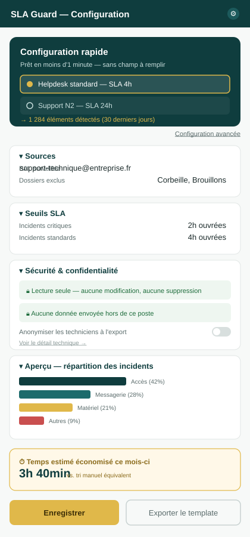
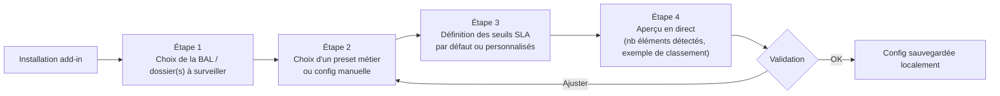

# HORS-SLA-VBA — Spécification de la configuration utilisateur

*Volet complémentaire à la spec technique v2 — porte sur l'expérience de configuration, la sécurité perçue, et la démonstration de valeur (gain de temps).*

---

## 0. Principe directeur

L'add-in s'exécute dans un **volet Outlook (task pane)**, pas dans une application web séparée. Toute la conception doit donc respecter cette contrainte : largeur étroite (~320-420px), pas de navigation complexe, interactions rapides. L'objectif de cette spec est de répondre à 6 questions concrètes :

1. Comment l'utilisateur configure ses besoins
2. Comment mettre en avant la configuration rapide
3. Comment la sécurité des éléments est affichée
4. Comment garantir qu'aucune donnée ne sort du poste local
5. Comment garantir les meilleurs graphiques
6. Comment garantir un gain de temps perçu sur les tâches pénibles/redondantes

---

## 1. Comment l'utilisateur configure ses besoins

### 1.1 Parcours de première configuration (wizard, one-time)

- **4 étapes maximum** — au-delà, le taux d'abandon d'un wizard grimpe fortement, en particulier dans un volet étroit.
- Chaque étape est **réversible** (bouton "Précédent" toujours visible).
- L'étape 4 (aperçu en direct) est celle qui rassure le plus : l'utilisateur voit concrètement ce que la config va produire **avant** de valider, sur ses propres données.

### 1.2 Configuration continue (post-wizard)

- Accessible via une icône ⚙️ fixe en haut du volet, à tout moment.
- Organisée en **sections repliables** (accordéon), pas en longue liste :
  - Sources (BAL, dossiers, exclusions)
  - Seuils SLA (par type d'incident / technicien / plage horaire)
  - Classification (dictionnaire de mots-clés, ajout/édition des familles)
  - Export (format, fréquence, feuilles incluses)
  - Sécurité & confidentialité (voir §3-4)
- **Aucune configuration critique par défaut cachée** : ce qui est appliqué doit toujours être visible en un clic (pas de réglage "magique" invisible).

### 1.3 Stockage de la configuration

- Fichier de config **local** (JSON ou XML), stocké dans `%APPDATA%\HORS-SLA-VBA\config.json`, ou à défaut via `SaveSetting`/`GetSetting` VBA (registre utilisateur local).
- Un même fichier de config peut être **exporté/importé** pour dupliquer un template vers une autre BAL ou un collègue (réponse directe au besoin "template par groupe BAL générique ou BAL d'équipe" du cadrage initial).

---

## 2. Mettre en avant la configuration rapide

### 2.1 Hiérarchie visuelle claire

- **Bouton primaire, grand format, en haut du volet** : *"Configuration rapide (1 min)"*.
- **Lien secondaire, discret, en dessous** : *"Configuration avancée"* — pour ne pas noyer l'utilisateur pressé.
- Le mode rapide utilise des **presets métier** prêts à l'emploi (ex. "Helpdesk standard — SLA 4h", "Support N2 — SLA 24h", "BAL générique — sans seuil"), sélectionnables en un clic radio, sans aucun champ à remplir.

### 2.2 Preuve immédiate de valeur

- Dès la sélection d'un preset, un **compteur en direct** affiche : *"→ 1 284 éléments détectés sur les 30 derniers jours avec cette configuration"*.
- Ce retour immédiat remplace un long formulaire par une **boucle de confiance rapide** : l'utilisateur voit que ça marche avant même d'avoir réglé le moindre détail.

### 2.3 Principe de configuration progressive

- Le mode rapide n'est jamais un cul-de-sac : chaque paramètre appliqué automatiquement reste **visible et modifiable** juste en dessous, sans changer d'écran (pas de redirection vers la config avancée pour un ajustement mineur).

---

## 3. Comment la sécurité des éléments est affichée

- **Aucun contenu de mail sensible affiché par défaut** — le volet montre des métadonnées (objet tronqué, expéditeur, date, statut SLA), jamais le corps du message, sauf action explicite de l'utilisateur ("Voir l'aperçu").
- **Indicateur de portée d'accès visible en permanence** : un bandeau discret précise ce que l'add-in lit (ex. *"Lecture seule — dossier 'Support N1' — aucune modification, aucune suppression"*).
- **Anonymisation optionnelle** pour les exports partagés à un tiers (ex. pour un reporting envoyé au-delà de l'équipe) : bascule *"Masquer les noms de technicien dans cet export"*.
- **Journal d'activité local consultable** : un onglet simple liste ce que l'outil a lu et exporté (horodaté), pour qu'un utilisateur ou un auditeur puisse vérifier a posteriori sans avoir à faire confiance aveuglément.

---

## 4. Garantir qu'aucune donnée ne sort du poste local

C'est la question de confiance la plus critique pour l'adoption par un service IT/sécurité — elle doit être **techniquement vraie**, pas seulement affichée.

### 4.1 Garantie technique (brique VBA)

- Le code VBA s'exécute **dans le process `OUTLOOK.EXE` local**. Aucun appel réseau sortant n'existe dans cette brique, sauf s'il est explicitement ajouté (ce qui ne doit pas être le cas pour la version desktop de base).
- Aucune dépendance à un service tiers, aucune télémétrie, aucun call API externe pour le cœur du produit (extraction, classification, export Excel).
- Le fichier de config et les exports Excel restent sur le poste (ou sur un lecteur réseau d'entreprise choisi par l'utilisateur), jamais transmis à un serveur externe.

### 4.2 Cas particulier de la brique Graph API (Phase 4 — OWA)

- Cette brique interroge **Microsoft Graph**, donc reste **dans le périmètre Microsoft 365 déjà utilisé par l'entreprise** — elle ne transite par **aucun serveur tiers, aucune infrastructure externe à Microsoft/l'entreprise**.
- Ce point doit être **explicité clairement dans l'UI** dès que la brique web est active, pour ne pas laisser penser à tort que "web = données qui sortent" : un bandeau dédié doit distinguer *"Traitement 100% local"* (VBA) de *"Traitement via votre tenant Microsoft 365"* (Graph API).

### 4.3 Affichage dans l'UI

- Badge fixe en bas du volet : 🔒 *"Aucune donnée envoyée hors de ce poste"* (mode VBA) ou 🔒 *"Traitement limité à votre environnement Microsoft 365"* (mode Graph API).
- Un lien *"Voir le détail technique"* ouvre une explication en langage clair, sans jargon, destinée à être montrée telle quelle à un RSSI ou un utilisateur méfiant.
- **Checklist de conformité** fournie en documentation séparée (à annexer à toute demande de validation IT/sécurité) : permissions utilisées, données lues, données stockées, données transmises (aucune par défaut).

---

## 5. Garantir les meilleurs graphiques

### 5.1 Principe : le graphique s'adapte à la donnée, pas l'inverse

L'utilisateur ne choisit pas un type de graphique dans une liste générique — l'outil **propose automatiquement** le type adapté selon la nature de la donnée sélectionnée, pour éviter les erreurs classiques (ex. camembert sur une série temporelle).

| Donnée | Graphique recommandé | Pourquoi |
|---|---|---|
| Délai de prise en compte par incident, dans le temps | Courbe / ligne temporelle | Montre la tendance (amélioration ou dégradation du SLA) |
| Répartition des incidents par type | Barres horizontales triées | Plus lisible qu'un camembert au-delà de 4-5 catégories |
| Charge par technicien | Barres empilées (volume traité vs hors-SLA) | Compare volume et qualité en un seul graphique |
| Charge par jour/heure | Heatmap (jours × heures) | Identifie les pics de charge invisibles en liste |
| Respect global du SLA | Jauge ou barre de progression simple | Lecture immédiate en un coup d'œil pour un manager pressé |

### 5.2 Génération native Excel

- Les graphiques sont générés en **graphiques natifs Excel** (pas d'image statique), via VBA (`Chart` objects) ou tableaux croisés dynamiques (TCD) pré-configurés — l'utilisateur peut les retoucher librement dans Excel sans dépendance à l'add-in.
- Un **modèle de mise en forme unique** (couleurs, police, légendes) est appliqué automatiquement à tous les graphiques générés, pour garantir une cohérence visuelle sans effort de la part de l'utilisateur.

### 5.3 Garde-fou

- Si un volume de données est trop faible pour qu'un graphique soit pertinent (ex. moins de 5 éléments), l'outil **affiche un message plutôt qu'un graphique vide ou trompeur** : *"Pas assez de données sur cette période pour un graphique fiable."*

---

## 6. Garantir un gain de temps perçu sur les tâches pénibles et redondantes

### 6.1 Rendre le gain de temps visible, pas seulement réel

- Un **compteur cumulé** affiché dans le volet : *"Temps estimé économisé ce mois-ci : 3h40"*, calculé par comparaison entre un traitement manuel estimé (temps moyen de tri/classement manuel × nombre d'éléments traités) et le temps réellement passé dans l'outil.
- Ce compteur sert un double objectif : **preuve de valeur pour l'utilisateur**, et **argument objectif pour justifier l'outil auprès d'un manager** (retour direct sur le besoin initial : "servirait énormément à mon boss").

### 6.2 Réduction concrète des actions répétitives

- **Filtres sauvegardés réutilisables en un clic**, au lieu de reconstruire une recherche à chaque fois.
- **Rafraîchissement automatique programmable** (ex. tous les matins à 8h) plutôt qu'une extraction manuelle systématique.
- **Export en un clic** vers un fichier Excel déjà structuré, plutôt qu'un copier-coller ou une mise en forme manuelle.
- **Templates de configuration par BAL** partageables entre collègues — ce qui a été réglé une fois pour une équipe ne doit jamais être reconfiguré par la suivante.

### 6.3 Comparaison avant/après explicite

- Un écran (ou une ligne de synthèse) type **"Avant / Avec l'outil"** :
  - Avant : tri manuel mail par mail, calcul de délai à la main, mise en forme Excel manuelle.
  - Avec l'outil : classification automatique, délai calculé automatiquement, export prêt à l'emploi.
- Cette mise en regard sert d'argument d'adoption dès le premier lancement (écran d'accueil du wizard, §1.1).

---

## 7. Synthèse — checklist de conformité de l'interface

- [ ] Wizard de configuration en 4 étapes maximum, avec aperçu en direct
- [ ] Bouton "Configuration rapide" visuellement prioritaire sur "Configuration avancée"
- [ ] Presets métier sélectionnables sans champ à remplir
- [ ] Compteur d'éléments détectés affiché en temps réel pendant la configuration
- [ ] Aucun contenu de mail sensible affiché sans action explicite
- [ ] Bandeau de portée d'accès (lecture seule) toujours visible
- [ ] Badge de localité des données toujours visible, avec explication accessible
- [ ] Distinction claire entre brique VBA (100% local) et brique Graph API (tenant M365)
- [ ] Graphique proposé automatiquement selon le type de donnée, jamais choisi "à l'aveugle"
- [ ] Message explicite si le volume de données est insuffisant pour un graphique fiable
- [ ] Compteur de temps gagné affiché et mis à jour en continu
- [ ] Configuration exportable/importable pour dupliquer un template entre BAL/équipes

---

*Fichier lié : `config-panel-mockup.svg` (maquette du volet de configuration).*
