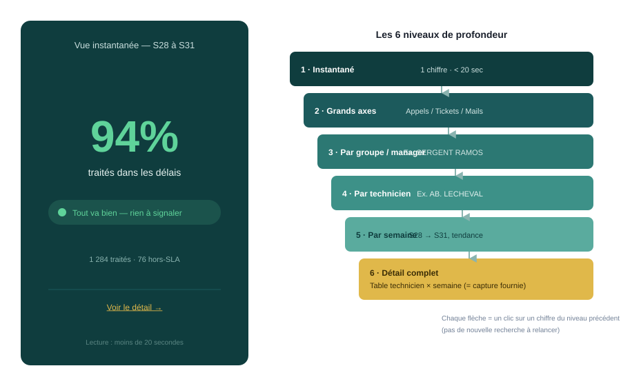
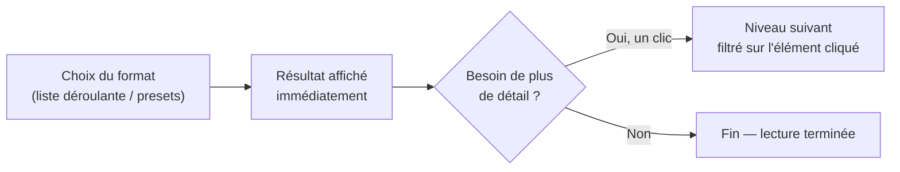

# HORS-SLA-VBA — Restitution progressive (drill-down 6 niveaux)

*Complément à la spec de configuration — répond au besoin : "l'user choisit juste un format et obtient directement ses chiffres", avec une profondeur de lecture qui va du global (20 secondes) jusqu'au détail complet.*

---

## 0. Principe directeur

L'utilisateur **ne construit pas de template**. Il choisit un **format de sortie** dans une liste prédéfinie (comme on choisirait un gabarit d'impression), et le résultat s'affiche **immédiatement avec ses vrais chiffres** — pas d'étape de configuration entre le choix et le résultat.

Chaque niveau se lit **en cliquant sur un chiffre du niveau précédent** (drill-down), jamais en relançant une recherche. La capture fournie par l'utilisateur correspond exactement au **niveau 6** décrit ci-dessous — c'est le point d'arrivée du parcours, pas le point de départ.

---

## 1. Les 6 niveaux de profondeur

| Niveau | Contenu | Temps de lecture cible | Analogie avec la capture fournie |
|---|---|---|---|
| **1 — Instantané** | Un seul indicateur global (ex. "94% dans les délais") | **< 20 secondes**, "bam, terminé" | Absent de la capture — c'est le résumé qui devrait précéder ce tableau |
| **2 — Grands axes** | 3-4 blocs (Appels / Tickets / Mails traités), total par bloc | ~30 secondes | Les 3 encadrés "APPELS TRAITÉS", "TICKETS TRAITÉS", "MAILS TRAITÉS" |
| **3 — Par groupe/manager** | Regroupement par responsable, total agrégé | ~1 minute | Les lignes "Admilson RAMOS MIRANDA" / "Thierry BACHAUMONT" |
| **4 — Par technicien** | Une ligne = un technicien, total sur la période | ~1-2 minutes | Les lignes nominatives (Alexandre HERTOUT, Catherine COQUILLON…) |
| **5 — Par semaine** | Ajout de la dimension temporelle, tendance visible | ~2-3 minutes | Les colonnes S28 à S31 |
| **6 — Détail complet** | Table croisée technicien × semaine × catégorie, brute | À la demande, usage de preuve/audit | **La capture fournie, telle quelle** |

### Lecture du principe

- **Niveau 1** doit exister **avant** tout le reste : c'est la réponse à "est-ce que ça va, oui ou non", sans lecture de tableau.
- **Niveaux 2 à 5** sont des **étapes de zoom progressif**, chacune atteignable en un clic depuis la précédente.
- **Niveau 6** est le tableau brut (comme la capture) — utile pour vérifier, justifier, auditer, mais **jamais le point d'entrée** de la lecture quotidienne.

---

## 2. Détail de chaque niveau

### Niveau 1 — Vue instantanée (< 20 sec)

- Un **seul chiffre**, gros, avec une couleur d'état (vert = OK, orange = vigilance, rouge = hors-SLA significatif).
- Exemple : **"94% traités dans les délais"** ou **"1 284 traités — 76 hors-SLA"**.
- Aucune interaction nécessaire pour comprendre : le chiffre + la couleur suffisent.
- Un seul lien discret en dessous : *"Voir le détail →"* pour amorcer la descente.

### Niveau 2 — Grands axes

- Reprend la structure de la capture : **3 blocs** (Appels traités / Tickets traités / Mails traités), chacun avec son total sur la période choisie.
- Chaque bloc reste un **résumé chiffré**, pas encore un tableau — objectif : identifier en un coup d'œil quel axe pèse le plus ou pose problème.
- Clic sur un bloc → descend au niveau 3, **filtré sur cet axe**.

### Niveau 3 — Par groupe/manager

- Regroupement hiérarchique, comme "Admilson RAMOS MIRANDA" / "Thierry BACHAUMONT" dans la capture.
- Total agrégé par groupe, avec éventuellement un indicateur de statut SLA par groupe (vert/orange/rouge).
- Clic sur un groupe → descend au niveau 4, filtré sur ce groupe.

### Niveau 4 — Par technicien

- Une ligne = un technicien, avec son total sur la période sélectionnée.
- Répond directement au besoin initial de cadrage : "Rendu par technicien — activité par email, temps de prise en compte".
- Clic sur un technicien → descend au niveau 5, filtré sur cette personne.

### Niveau 5 — Par semaine

- Ajoute la dimension temporelle (S28, S29, S30, S31…), avec une **tendance visible** (flèche ↑/↓, delta en %) plutôt qu'une simple liste de nombres.
- Permet de répondre à "est-ce que ça s'améliore ou ça se dégrade" sans encore aller au détail complet.

### Niveau 6 — Détail complet (= la capture fournie)

- Table croisée **technicien × semaine**, groupée par manager, une table par catégorie (Appels/Tickets/Mails).
- C'est le niveau de **preuve** : utilisé pour justifier un chiffre, auditer, ou exporter tel quel vers Excel.
- Accessible en permanence via un bouton *"Voir la table complète"*, sans devoir refaire tout le parcours des niveaux 1 à 5 à chaque fois (accès direct possible si l'utilisateur sait déjà ce qu'il cherche).

---

## 3. Choix du format — pas de construction, juste une sélection

- Une **liste déroulante ou des boutons presets** en haut de l'écran de résultats : *"Vue Express"*, *"Vue par équipe"*, *"Vue par technicien"*, *"Table complète (Excel)"*.
- Chaque format correspond directement à l'un des 6 niveaux ci-dessus — l'utilisateur choisit un **point d'entrée**, pas un montage.
- Le passage d'un niveau à l'autre ensuite se fait par **clic sur un chiffre**, jamais par un nouveau choix dans un menu.

## 4. Export

- **Chaque niveau est exportable indépendamment** vers Excel — un manager peut exporter uniquement le niveau 3 (vue par groupe) sans avoir à extraire toute la table brute.
- Le niveau 6, lui, correspond à l'export "complet" équivalent à la capture fournie — format déjà connu et validé par l'utilisateur, donc à préserver **tel quel** comme format d'export de référence.

---

*Fichier lié : `drilldown-mockup.svg` (maquette du niveau 1 + schéma des 6 niveaux).*
