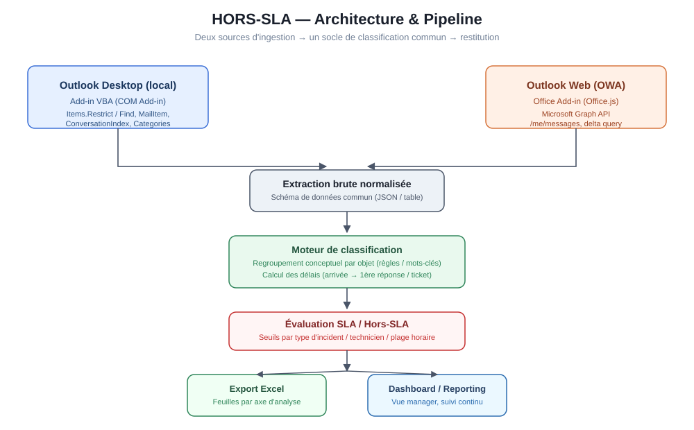
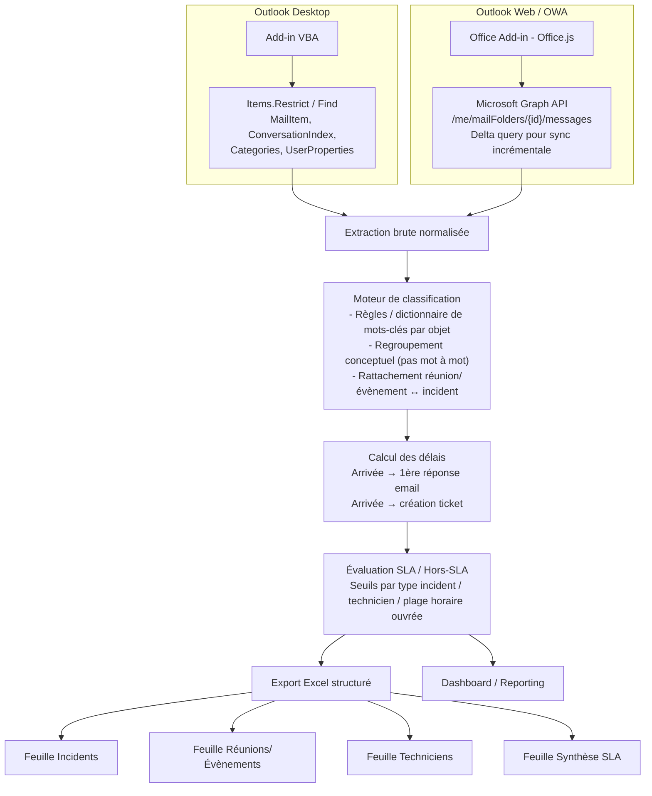
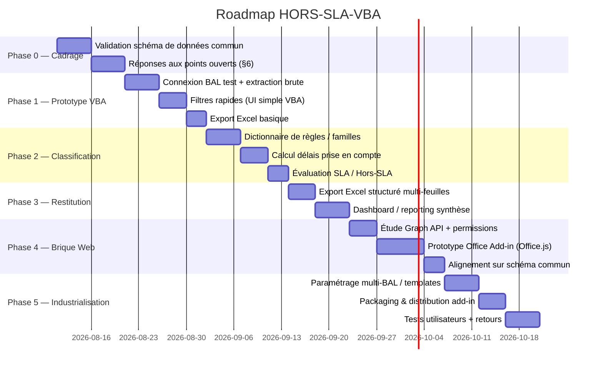

# HORS-SLA-VBA

**Monitoring email & SLA directement dans Outlook — spécification détaillée**

*Version 2 — architecture, pipeline, roadmap, implémentation*

---

## 0. Résumé exécutif

| | |
|---|---|
| **But** | Objectiver le respect des SLA (délais de traitement) sur une ou plusieurs BAL Outlook, sans outil tiers, avec export Excel exploitable. |
| **Contrainte** | VBA fonctionne uniquement sur Outlook Desktop → une brique séparée (Graph API) est nécessaire pour OWA. |
| **Livrable final** | Un add-in Outlook installable (VBA/COM) + une brique Graph API optionnelle, alimentant un même schéma de données et un export Excel unique. |
| **Complexité principale** | Le moteur de classification conceptuelle (regrouper les objets de mail par type d'incident, pas par mot-clé exact) — c'est le vrai cœur technique du projet, pas l'extraction. |

---

## 1. Contexte

Reprise d'un ancien projet visant à outiller le suivi des délais de traitement (SLA / hors-SLA) directement depuis Outlook. Le besoin est double :

- **Usage individuel/managérial** : suivi de l'activité d'une BAL ou d'une équipe.
- **Outil réutilisable** : template générique adaptable par BAL, potentiellement diffusable à d'autres équipes/services.

## 2. Contrainte technique clé — pourquoi deux briques

| Contexte | Techno possible | Pourquoi |
|---|---|---|
| Outlook Desktop (client lourd Windows) | **VBA** (Project → VBAProject.OTM, packagé en COM Add-in `.dll`/`.otm` ou macro partagée) | Accès natif à `Application.Session`, `Items`, `MailItem`, exécution locale sans permissions API |
| Outlook Web (OWA) / mobile | **Impossible en VBA** → **Microsoft Graph API** (REST) via un **Office Add-in (Office.js + HTML/JS)**, ou **Power Automate** pour l'automatisation sans interface | OWA s'exécute dans un navigateur, aucun moteur VBA disponible côté client |

➡️ **Conséquence architecturale** : les deux briques doivent produire une sortie **strictement identique en structure** (mêmes colonnes, mêmes types, mêmes règles de classification) pour que l'agrégation finale (Excel/dashboard) soit cohérente, qu'un utilisateur soit sur desktop ou sur le web.

---

## 3. Architecture cible

### 3.1 Schéma de données commun (contrat entre les deux briques)

C'est **la pièce la plus importante** du projet : tant que ce schéma n'est pas figé, aucune des deux briques ne doit être développée en profondeur.

| Champ | Type | Source VBA | Source Graph API | Notes |
|---|---|---|---|---|
| `id_element` | string | `MailItem.EntryID` | `message.id` | Identifiant unique |
| `conversation_id` | string | `MailItem.ConversationID` | `message.conversationId` | Pour regrouper un fil complet |
| `type_element` | enum | Mail / RDV / Tâche | idem | `Mail`, `Meeting`, `Task`, `Event` |
| `objet` | string | `MailItem.Subject` | `message.subject` | Source du classement conceptuel |
| `expediteur` | string | `MailItem.SenderEmailAddress` | `message.from.emailAddress.address` | |
| `destinataire_bal` | string | `Item.Parent.Owner` ou nom du dossier | `mailFolder` parent | Pour distinguer les BAL |
| `date_arrivee` | datetime | `MailItem.ReceivedTime` | `message.receivedDateTime` | Référence pour le calcul SLA |
| `date_premiere_reponse` | datetime | via `ConversationIndex` du 1er mail de réponse | via `conversationId` + tri chronologique | Calculé, pas natif |
| `date_creation_ticket` | datetime | Nécessite mapping externe (voir §6.1) | idem | Dépend de l'outil de ticketing |
| `categorie_outlook` | string | `MailItem.Categories` | `message.categories` | Tag manuel existant, réutilisable |
| `type_incident` | string (calculé) | Moteur de classification | idem | Résultat du regroupement conceptuel |
| `technicien` | string | Dossier / catégorie / expéditeur de la réponse | idem | |
| `duree_reunion_min` | int | `AppointmentItem.Duration` | `event.end - event.start` | Uniquement si `type_element = Meeting/Event` |
| `delai_prise_en_compte_min` | int (calculé) | `date_premiere_reponse - date_arrivee` | idem | Cœur du KPI SLA |
| `statut_sla` | enum (calculé) | `OK` / `Hors-SLA` | idem | Selon seuils définis en §6.2 |

> Ce tableau doit être validé en premier — c'est le "contrat d'interface" entre VBA et Graph API.

---

## 4. Axes de classification / tri (détaillés)

- **Temps de réunion** — durée agrégée par sujet/ticket, avec distinction réunion interne vs réunion client.
- **Temps d'évènement** — créneaux bloqués liés à une activité (préparation, astreinte…).
- **Type d'incident** — regroupement **conceptuel** par objet :
  - Approche recommandée : dictionnaire de **familles de mots-clés** (ex. famille "Accès" = accès, connexion, login, mot de passe, VPN…) plutôt qu'un mot-clé unique.
  - Évolution possible : score de similarité (distance de Levenshtein ou embeddings légers) si le dictionnaire de règles devient insuffisant.
- **Type de tâches** — issues des `TaskItem` Outlook ou des tickets liés.
- **Rendu par technicien** :
  - Activité par email (volume envoyé/reçu/traité).
  - **Temps de prise en compte** — délai entre arrivée et 1ère réponse (email **ou** création de ticket, le premier des deux événements).
  - *(à compléter — voir §6 pour les points ouverts : charge de travail, taux de réouverture, etc.)*

---

## 5. Roadmap détaillée

### Détail par phase

| Phase | Objectif | Durée indicative | Sortie |
|---|---|---|---|
| **0 — Cadrage** | Verrouiller le schéma de données et répondre aux points ouverts | ~2 sem. | Document validé, schéma figé |
| **1 — Prototype VBA** | Prouver la faisabilité technique sur 1 BAL | ~2 sem. | Macro fonctionnelle, extraction + export brut |
| **2 — Classification** | Construire le moteur de règles + calcul des délais | ~2 sem. | Moteur testé sur données réelles anonymisées |
| **3 — Restitution** | Rendre le résultat exploitable par un manager | ~2 sem. | Excel multi-feuilles + synthèse |
| **4 — Brique Web** | Couvrir les utilisateurs OWA | ~3 sem. | Add-in Office.js + Graph API alignés sur le schéma |
| **5 — Industrialisation** | Rendre l'outil réutilisable par d'autres équipes | ~2-3 sem. | Add-in packagé, config par BAL, doc utilisateur |

---

## 6. Points à clarifier avant développement (bloquants pour la Phase 0)

1. **Source du "ticket"** : quel outil (ServiceNow, GLPI, Jira, EasyVista…) ? API disponible ? Notification par mail à un format fixe exploitable en parsing ?
2. **Définition du "hors-SLA"** : seuil fixe, ou variable par type d'incident / technicien / plage horaire ouvrée (ex. 9h-18h, hors week-end) ?
3. **Rattachement réunion/évènement ↔ incident** : via objet, catégorie Outlook, ou identifiant dans le corps du message ?
4. **Volume de BAL concernées** : une BAL pilote pour commencer, ou plusieurs d'emblée (impacte fortement le choix VBA seul vs Graph API dès la Phase 1) ?
5. **Distribution** : add-in signé/déployé via le Centre d'administration Microsoft 365 (recommandé pour la diffusion à d'autres équipes), ou macro `.otm`/fichier partagé en usage restreint ?
6. **Droits d'accès Graph API** : permissions **déléguées** (l'utilisateur autorise, plus simple à mettre en place) vs **applicatives** (accès BAL de service sans interaction utilisateur, nécessite validation IT/sécurité) ?
7. **Confidentialité / RGPD** : le monitoring du temps de traitement par technicien touche à de la donnée RH-sensible → à valider avec le service concerné avant tout déploiement au-delà d'un pilote.

---

## 7. Notes d'implémentation VBA (Phase 1)

- **Recherche/filtre** : privilégier `Items.Restrict()` (filtre DASL, rapide) plutôt que `Items.Find`/`FindNext` en boucle pour les gros volumes.
- **Regroupement de fil de discussion** : `MailItem.ConversationID` + `Application.Session.GetNamespace("MAPI")` permettent de reconstituer un fil et d'identifier la 1ère réponse sortante (`MailItem.SenderEmailAddress = adresse du technicien`).
- **Catégories existantes** : réutiliser `MailItem.Categories` si l'équipe tague déjà ses mails — cela peut servir de première approximation gratuite pour `type_incident`.
- **Performance** : sur une BAL volumineuse (>50k éléments), filtrer d'abord par date avant tout traitement en boucle, et désactiver `Application.ScreenUpdating`-équivalent (limiter les I/O sur l'UI Outlook).
- **Export Excel** : privilégier `Application.CreateObject("Excel.Application")` avec écriture par tableau (array VBA → `Range.Value = arr`) plutôt que cellule par cellule (gain de performance x10 à x50 sur gros volumes).

## 8. Notes d'implémentation Graph API (Phase 4)

- Endpoint principal : `GET /me/mailFolders/{id}/messages` (ou `/users/{id}/messages` en applicatif).
- Utiliser le **delta query** (`/messages/delta`) pour ne récupérer que les changements après la première synchronisation complète — évite de tout re-télécharger à chaque exécution.
- Attention au **throttling** (limite de requêtes) — prévoir une gestion des erreurs `429` avec backoff.
- Pour les réunions : `GET /me/events` avec les mêmes principes.

---

## 9. Prochaines étapes immédiates

1. Valider ce document — en particulier le **schéma de données commun (§3.1)** et les **points ouverts (§6)**.
2. Choisir la **BAL pilote** pour la Phase 1.
3. Statuer sur le point 6 du §6 (permissions Graph API) si la brique Web doit démarrer en parallèle plutôt qu'en Phase 4.
4. Démarrer le prototype VBA (extraction + filtres + export brut) sur la BAL pilote.

---

*Fichiers liés : `architecture-pipeline.svg` (diagramme), pipeline Mermaid intégré ci-dessus (section 3), Gantt Mermaid intégré (section 5).*
