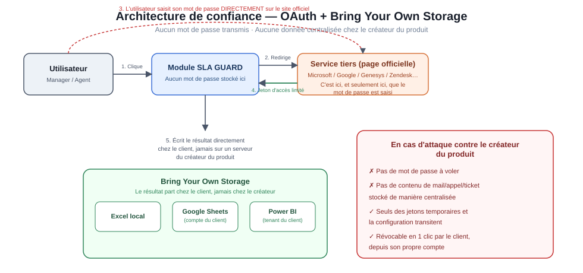
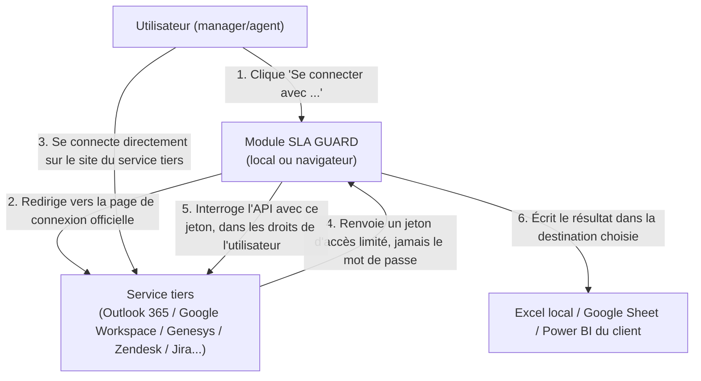
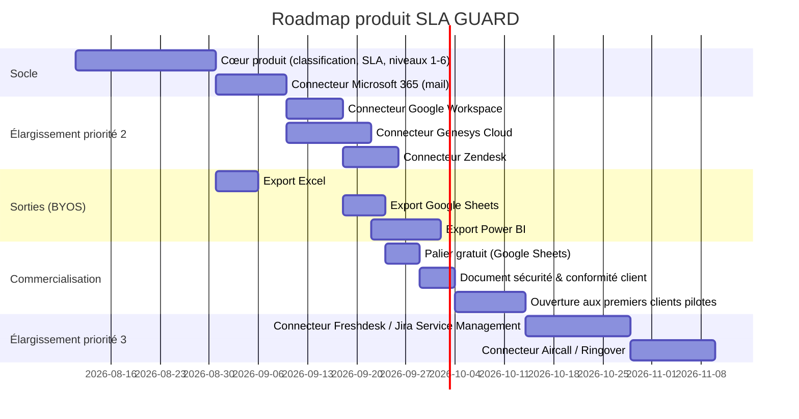

# SLA GUARD — Document stratégique complet

*De l'outil interne au produit commercial : monitoring de délais/SLA sur téléphonie, email et ticketing, multi-clients.*

---

## 0. Résumé exécutif

| | |
|---|---|
| **Pitch** | Un outil qui donne aux managers, en quelques clics, les chiffres qu'ils passent aujourd'hui des heures à compiler à la main — sur téléphonie, email et ticketing — sans jamais voir ni stocker leurs identifiants ni leurs données. |
| **Cible** | Managers/chefs d'équipe support, centres d'appel, helpdesk IT — dans des structures de toute taille, qui n'ont ni le temps ni l'outillage pour du reporting SLA fiable. |
| **Différenciateur clé** | Connexion officielle (OAuth) par service, **jamais de mot de passe stocké**, stockage du résultat au choix du client (Excel, Power BI, ou Google Sheets en version gratuite) — donc **le client reste propriétaire de sa donnée du début à la fin**. |
| **Modèle** | Produit "self-service" : le manager configure et connecte lui-même en quelques minutes, sans ticket IT, sans installation lourde. |
| **Risque principal identifié et corrigé** | Le réflexe "email + mot de passe, pas d'API" (évoqué initialement) est en réalité le point le plus dangereux du projet — corrigé ci-dessous en architecture zero-trust basée sur OAuth. |

---

## 1. Vision produit & positionnement

### 1.1 Le problème réel

Les managers de terrain (support technique, centres d'appel, helpdesk) doivent aujourd'hui **prouver** que leur équipe respecte ses délais — pour leur direction, pour un client, pour un audit — mais n'ont que des outils cloisonnés (Outlook, Genesys, un ticketing) qu'ils croisent **à la main**, souvent dans un tableur reconstruit chaque semaine. C'est long, source d'erreurs, et jamais vraiment à jour.

### 1.2 La proposition de valeur

> "Vos chiffres SLA, sans le travail de compilation. Vous vous connectez avec vos comptes habituels, en toute sécurité — jamais un mot de passe stocké chez nous, jamais une donnée exploitée par nous. Vos résultats sortent où vous voulez : Excel, Power BI, ou Google Sheets si vous restez sur du gratuit."

### 1.3 Pourquoi ça peut se vendre

- **La douleur est réelle et répétée** : c'est une tâche pénible, redondante, faite manuellement chaque semaine par des gens payés pour manager, pas pour compiler des tableaux.
- **Le marché est large** : toute structure avec une BAL partagée, une file d'appels, ou un outil de ticketing a ce besoin — pas seulement les grands centres d'appel.
- **La barrière à l'entrée est faible pour le client** : pas d'installation lourde, pas de validation IT longue (grâce à l'architecture OAuth, voir §2) — ce qui réduit énormément le cycle de vente comparé à un outil qui demanderait une intégration technique.
- **L'argument de confiance devient un argument de vente**, pas juste une contrainte technique — voir §1.4.

### 1.4 L'argument commercial central : la confiance, pas juste la fonctionnalité

Un chef d'équipe échaudé par des outils intrusifs n'achètera pas un produit qui lui demande son mot de passe. Le positionnement doit donc être :

- **"On ne voit jamais vos mots de passe"** — connexion officielle via le bouton "Se connecter avec Microsoft / Google / Genesys", comme n'importe quel service grand public sérieux.
- **"Vos données restent chez vous"** — le résultat part directement vers le fichier/outil choisi par le client (Excel local, Google Sheet du client, ou tableau de bord Power BI du client), pas vers un serveur du créateur du produit.
- **"En cas d'incident chez nous, rien ne fuite chez vous"** — parce qu'il n'y a structurellement rien de sensible à voler (voir §2).

Ce dernier point répond directement au besoin exprimé : *garantir qu'aucune donnée tierce ne soit divulguée ni exploitée en cas d'attaque cyber* — mais la garantie ne peut être crédible que si elle est **vraie techniquement**, pas juste affichée. D'où la correction d'architecture ci-dessous.

---

## 2. Architecture de confiance (corrigée)

### 2.1 Le principe : OAuth partout, jamais de mot de passe stocké

- **Le mot de passe ne transite jamais par SLA GUARD** — il est saisi uniquement sur la page officielle du service tiers (Microsoft, Google, Genesys…), exactement comme pour n'importe quel "Se connecter avec Google" que l'utilisateur connaît déjà.
- **Le jeton obtenu est limité** : il ne donne accès qu'à ce que l'utilisateur est autorisé à voir (ses mails, ses appels, ses tickets — ou ceux de son équipe si son rôle le permet), et il est révocable à tout moment par l'utilisateur lui-même depuis son compte Microsoft/Google/Genesys.
- **Aucune installation lourde, aucun UAC** : la connexion OAuth se fait dans une fenêtre de navigateur, sans droits administrateur — ce qui répond au vrai besoin ("rapide, sans friction IT") sans passer par un mot de passe stocké.

### 2.2 Le principe "Bring Your Own Storage" (BYOS)

Le résultat n'est **jamais conservé sur un serveur du créateur du produit** — il part directement vers la destination choisie par le client :

| Destination | Public visé | Coût | Ce que ça implique techniquement |
|---|---|---|---|
| **Excel local** | Utilisateur individuel, PME, pas d'infra cloud | Gratuit (Excel déjà possédé) | Écriture directe sur le poste, aucun serveur intermédiaire |
| **Google Sheets** | Version gratuite / petites structures | Gratuit | Écriture via l'API Google Sheets, dans le compte Google **du client**, pas un compte du créateur |
| **Power BI** | Structures avec déjà un existant Microsoft/BI | Payant (licence Power BI déjà détenue ou add-on) | Publication du jeu de données dans le tenant Power BI **du client** |

➡️ Dans les trois cas, la donnée finale vit **dans l'environnement du client**, jamais dans une base centralisée appartenant au créateur du produit. C'est ce qui rend la promesse "vos données restent chez vous" techniquement vraie, et pas seulement une phrase marketing.

### 2.3 Ce que ça signifie en cas d'attaque cyber contre le créateur du produit

- S'il n'y a **aucun mot de passe stocké** et **aucune donnée client centralisée**, une attaque contre l'infrastructure du créateur ne peut pas exposer les mails, appels ou tickets des clients — il n'y a simplement rien de tel à voler.
- Ce qui reste à protéger (et qui doit l'être sérieusement) : les éventuels jetons d'accès temporaires en transit, et la configuration (quels connecteurs sont activés, quels seuils SLA sont définis) — nettement moins sensible que des mots de passe ou du contenu de mails.
- Cette architecture doit être formalisée dans un **document de sécurité type "Data Processing" en langage clair**, remis à chaque client avant signature (voir §5).

### 2.4 Ce que cette architecture implique pour le développement

- Chaque connecteur (téléphonie / mail / ticketing) nécessite d'implémenter le flux OAuth **spécifique à ce service** (voir §3) — c'est plus de travail initial que "un seul système mot de passe universel", mais c'est la seule option qui tient la promesse de sécurité, et c'est aussi la seule qui soit acceptée par les services tiers eux-mêmes (la plupart interdisent contractuellement l'authentification par mot de passe pour une appli tierce).
- Le produit devient une **plateforme de connecteurs**, pas un outil monolithique — ce qui est en réalité un avantage business : chaque connecteur ajouté élargit le marché adressable sans repenser l'architecture.

---

## 3. Catalogue de connecteurs — priorisation

### 3.1 Grille de priorisation

| Connecteur | Catégorie | Méthode d'auth | Effort d'intégration | Marché potentiel | Priorité |
|---|---|---|---|---|---|
| Microsoft 365 (Outlook/Graph) | Mail | OAuth2 délégué | Faible (déjà spécifié) | Très large (quasi standard en entreprise) | **1 — déjà en cours** |
| Google Workspace (Gmail API) | Mail | OAuth2 | Faible | Large (PME, startups) | **2** |
| Genesys Cloud | Téléphonie | OAuth2 PKCE | Moyen (déjà spécifié) | Centres d'appel, grands comptes | **2** |
| Zendesk | Ticketing | OAuth2 | Faible | Large (support client, SaaS) | **2** |
| Freshdesk | Ticketing | API key + OAuth2 | Faible | PME support | **3** |
| Jira Service Management | Ticketing | OAuth2 | Moyen | IT/DevOps, grands comptes | **3** |
| ServiceNow | Ticketing | OAuth2 | Moyen-élevé (souvent config spécifique client) | Grands comptes | **3** |
| Aircall / Ringover | Téléphonie | OAuth2 / API key | Faible-moyen | PME, startups (call center léger) | **3** |
| GLPI | Ticketing | API REST + jeton | Moyen | IT interne, secteur public/éducation FR | **4** |
| Avaya / 3CX | Téléphonie | Variable selon version (souvent API propriétaire) | Élevé | Grands comptes historiques | **4** |

### 3.2 Logique de priorisation

1. **Priorité 1-2** : connecteurs à **OAuth standard, bien documenté, large marché** — permettent de sortir un produit vendable rapidement sur le cœur de cible (support/helpdesk avec Microsoft/Google + un ticketing courant).
2. **Priorité 3** : connecteurs qui élargissent vers des comptes plus grands ou des besoins plus spécifiques, une fois le socle validé commercialement.
3. **Priorité 4** : connecteurs plus coûteux à intégrer (API non standardisée, souvent propre à chaque déploiement client) — à traiter **à la demande d'un client signé**, pas en anticipation.

### 3.3 Principe de développement : un connecteur = un module indépendant

Chaque connecteur doit être développé comme un **module isolé**, respectant :
- le même schéma de données commun (déjà défini pour Outlook/Genesys),
- le même flux OAuth générique (adapté au service),
- la même politique "zéro stockage centralisé".

Cela permet d'ajouter un nouveau connecteur **sans toucher au cœur du produit** (classification, calcul SLA, restitution progressive à 6 niveaux déjà spécifiée) — le cœur du produit ne change pas, seule la couche de connexion s'étend.

---

## 4. Modèle business

### 4.1 Segmentation

| Segment | Profil | Levier d'achat |
|---|---|---|
| **Auto-service gratuit** | Petites équipes, managers individuels testant l'outil | Google Sheets en sortie, connecteurs limités (1 mail + 1 ticketing) |
| **PME / équipe support** | Managers de 5-30 personnes | Excel + connecteurs illimités, seuils SLA personnalisés |
| **Grand compte / centre d'appel** | Structures avec téléphonie + ticketing + volumétrie importante | Power BI natif, connecteurs avancés (Genesys, ServiceNow), support dédié |

### 4.2 Modèle de pricing suggéré (à valider/affiner)

- **Palier gratuit** : export Google Sheets uniquement, 1-2 connecteurs, usage individuel — sert de porte d'entrée virale ("le chef d'à côté voit le résultat et veut la même chose").
- **Palier payant par utilisateur ou par équipe** : export Excel + Power BI, connecteurs illimités, presets sectoriels (helpdesk, centre d'appel…), historique plus long.
- **Palier entreprise** : connecteurs sur devis (ServiceNow, Avaya, intégrations spécifiques), accompagnement à la mise en place, SLA de support du produit lui-même.

### 4.3 Go-to-market

- **Message d'entrée** : ne pas vendre "un outil de monitoring" (générique, déjà vu), mais vendre **le temps regagné et la preuve chiffrée immédiate** — cohérent avec le niveau 1 de restitution déjà spécifié ("94% dans les délais, bam, terminé").
- **Canal naturel** : les managers eux-mêmes, via un essai gratuit auto-service (aligné avec l'architecture "sans installation lourde, sans validation IT longue") — c'est un avantage concurrentiel direct sur ce marché, où la plupart des outils concurrents demandent une intégration IT lourde.
- **Preuve sociale** : le palier gratuit Google Sheets sert de vitrine à faible friction pour convaincre avant l'achat.

---

## 5. Garanties sécurité & conformité — à formaliser en document client

Un document dédié, court et en langage clair, doit être prêt **avant le premier client**, couvrant :

- [ ] Description de l'architecture OAuth (aucun mot de passe transmis ni stocké)
- [ ] Description du principe BYOS (aucune donnée client centralisée)
- [ ] Liste exacte des permissions demandées par connecteur (lecture seule, jamais d'écriture/suppression)
- [ ] Procédure de révocation d'accès côté client (comment couper l'accès à tout moment, en 1 clic depuis son propre compte Microsoft/Google/Genesys)
- [ ] Conformité RGPD : base légale du traitement, durée de conservation (nulle si BYOS strict), sous-traitants éventuels
- [ ] Plan de réponse en cas d'incident de sécurité côté créateur du produit — et pourquoi son impact sur les clients est structurellement limité (voir §2.3)

---

## 6. Roadmap produit (macro)

---

## 7. Risques identifiés et mitigations

| Risque | Mitigation |
|---|---|
| Tentation de simplifier via mot de passe stocké pour aller plus vite | Refuser structurellement — c'est le socle de confiance du produit, pas un détail technique optionnel |
| Un connecteur à API non standard (Avaya, ServiceNow spécifique) ralentit le développement | Traiter en priorité 3-4, à la demande d'un client signé, jamais en anticipation |
| Un client craint que "Power BI/Excel" révèle quand même des infos à un tiers via un service cloud | Documenter précisément dans quel tenant/compte chaque donnée atterrit (§2.2), avec schéma à l'appui |
| Dépendance à la disponibilité/API de chaque service tiers | Prévoir une gestion d'erreur claire par connecteur, sans casser les autres connecteurs actifs |
| Cycle de vente allongé par la nécessité de validation IT malgré tout, dans les grands comptes | Le palier gratuit/PME sert de preuve d'usage avant la discussion avec un grand compte |

---

## 8. Prochaines étapes immédiates

1. Valider ce document — en particulier le §2 (architecture de confiance), qui est la fondation de tout le reste.
2. Choisir le **premier connecteur mail à finaliser** (Microsoft 365, déjà en cours) comme socle de démonstration commerciale.
3. Rédiger le document sécurité/conformité client (§5) en parallèle du développement, pas après — il conditionne la crédibilité commerciale dès les premiers échanges avec un prospect.
4. Identifier 2-3 profils de clients pilotes potentiels (le "chef" mentionné en premier lieu peut être le tout premier cas d'usage réel à documenter comme preuve).

---

*Fichier lié : `trust-architecture.svg` (schéma de l'architecture de confiance OAuth + BYOS).*
